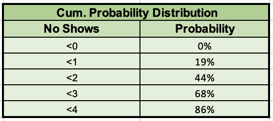

# Predictive Analytics on Profits of an Airline Model

# About

This project takes fictional airline data and applies a predictive model to it. The data consists of a unique identifier as a flight number, the demand for the flight, and the number of no-shows for the flight. The data was given to us by our lecturer.

The data was given to us by our lecturer and is available in the GitHub repository.

Skills Showcased

-   Excel
-   Data Processing
-   Predictive Analytics

[View more projects like this!](https://jeff-bow.github.io/)

# Preparing the Data

The assignment looked at the effect on an airlines profit in the event of overselling a flight. The model assumes there are 100 seats per flight. It assumes that bumping a passenger (moving a passenger with an oversold ticket to the next flight) costs either €125 or €300. The model also assumes that bumped passengers are given a seat by the airline and that there is no infinite carryover of bumped passengers as demand is occasionally low enough that there are no bumped passengers.

The model simulated the result of overselling a flight by 1, 2, 3, 4, or 5 seats

The model used several of Excels formulas to generate random values, rounding, norminv, if statements, and then compiled them into a table showing the effect of over booking a flight on the airlines profit. The model randomizes the demand for the flight, number of passengers that are 'bumped' and number of passengers that do not show up.

The model takes into account the effect on cost of 'bumping' a passenger if the time of day is later than 7pm. This is because the airline would likely have to pay for a hotel room for customers for the night.

``` excel
=ROUND(NORMINV($M4,'Inputs and Outputs'!$C$18,'Inputs and Outputs'!$D$18),0)
=MIN(H4,I4)
=IF(J4-G4>'Inputs and Outputs'!$D$4,One-G4,0)
=RAND()
=AVERAGE('/Users/jeffbowers/Downloads/[Basic Model Team 36 Green Airways (2).xlsx]Model Part A'!$AO$4:$AO$1095)
=MEDIAN('/Users/jeffbowers/Downloads/[Basic Model Team 36 Green Airways (2).xlsx]Model Part A'!$AO$4:$AO$1095)
=STDEV.P('/Users/jeffbowers/Downloads/[Basic Model Team 36 Green Airways (2).xlsx]Model Part A'!$AO$4:$AO$1095)
=MAX('/Users/jeffbowers/Downloads/[Basic Model Team 36 Green Airways (2).xlsx]Model Part A'!$AO$4:$AO$1095)
=MIN('/Users/jeffbowers/Downloads/[Basic Model Team 36 Green Airways (2).xlsx]Model Part A'!$AO$4:$AO$1095)
=COUNTIF('Model Part B'!G4:G1503,'Inputs and Outputs'!$F21)
```

Probability Distribution of no shows:


Cumulative Probability Distribution of no shows:



Profit Statistics with model applied:


Sensitivity Analysis with model applied:


# Limitations of the model

-   Randomly generated numbers are never truly random as they are generated by mathematical algorithms.
-   Anecdotally the passengers who miss flights are typically not individual flyers, but a group will often miss their flight due to a     mishap that affects the entire group.

# Improvements that could be made to make the model more realistic

Account for customers who will attempt to claim for more than €200 compensation. Customers who will require additional service and customer care in exchange for being bumped. We could estimate the maximum reimbursement the airline is able to give and estimate the likelihood of a bumped customer requesting more than €200 and factoring that into the model. 

Account for snack sales on the flight based on an estimate of each customer spending €5 with a profit to the airline of €2 and factoring this in to the profit of the flight.

